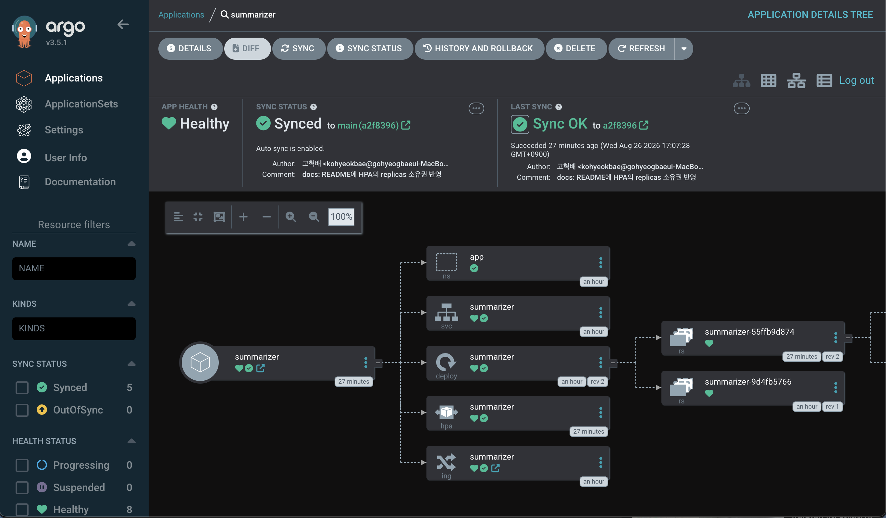

# EKS GitOps Portfolio — 온프레미스 솔루션 운영 경험의 클라우드 네이티브 전환

> 솔루션 엔지니어로서 Docker · PostgreSQL · 모니터링을 운영하며 겪은 한계(수동 배포, 수동 장애 대응, 환경 재구축의 어려움)를
> AWS 클라우드 네이티브 방식(IaC + GitOps + 관측성)으로 직접 해결해본 프로젝트입니다.

## 1. 프로젝트 개요

| 항목 | 내용 |
|---|---|
| 목표 | Claude API를 연동한 AI 텍스트 요약 서비스를 EKS 위에 GitOps 방식으로 배포하고, 모니터링/알람까지 구축 |
| 기간 | 2026.07.24 ~ 2026.08 (주말·저녁 활용, 실작업 약 7일) |
| 리전 | ap-northeast-2 (서울) |
| 핵심 기술 | Terraform, EKS, RDS(PostgreSQL), GitHub Actions(OIDC), ArgoCD, Kustomize, Prometheus/Grafana, CloudWatch, Claude API |
| 규모 | Terraform 리소스 78개 · 트러블슈팅 기록 7건 · ADR 3건 · 수명주기 재현 5회 |

### 왜 이 프로젝트인가

- **배포 자동화 부재** → Git push 하나로 빌드부터 배포까지 이어지는 GitOps 파이프라인 구축
- **환경 재구축의 어려움** → Terraform으로 전체 인프라를 코드화하여 20분 내 재구축 가능
- **수동 장애 대응** → Prometheus/Grafana 대시보드 + Slack 알람으로 선제적 감지

## 2. 아키텍처

```
[배포 파이프라인 — 사람의 개입은 git push 하나]
git push ─▶ GitHub Actions ──(OIDC — 액세스 키 없는 인증)──▶ ECR (이미지 push)
(app repo)      └── 이미지 태그 자동 커밋 ─▶ manifest repo(비공개, Kustomize)
                                                  ▲ auto-sync (drift 감지·자동 복구)
                                               ArgoCD ──▶ 무중단 롤링 배포
┌─ VPC 10.0.0.0/16 (2 AZ) ─────────────────────────┼──────────────────────────┐
│  Public Subnet   : ALB(internet-facing) · NAT ×1 ▼                          │
│  Private Subnet  : EKS 1.31 노드그룹 (t3.medium ×2, Spot)                   │
│                    ├─ App Pods 2~6 (HPA) — FastAPI, Claude API 호출(NAT)    │
│                    ├─ ALB Controller · ArgoCD · EBS CSI  ← IRSA로 권한 분리 │
│                    └─ Prometheus · Grafana · Alertmanager ──▶ Slack 알람    │
│  DB Subnet       : RDS PostgreSQL 17 (db.t3.micro, Single-AZ)               │
└──────────────────────────────────────────────────────────────────────────────┘
[사용자 트래픽]  인터넷 ─▶ ALB ─▶ 파드(target-type: ip 직접 라우팅) ─▶ RDS
[RDS 지표]      CloudWatch ─▶ cloudwatch-exporter ─▶ Prometheus (알람 경로 단일화)
```

- 컨트롤러·익스포터별 **IRSA**(IAM Roles for Service Accounts) 4종으로 파드 단위 최소 권한
- RDS 보안그룹은 노드 SG 참조 방식으로 5432만 허용 — CIDR이 아닌 신원 기반 규칙

### 의도적으로 제외한 것 (과하지 않게)

Istio 등 서비스 메시, 멀티 클러스터, Karpenter — 이 규모에서는 복잡도 대비 이득이 없다고 판단.
상세한 이유는 [docs/adr](docs/adr/)의 의사결정 기록 참고.

## 3. 실증 결과

모든 항목은 구축 후 별도 세션에서 **재현 검증**까지 마쳤다 (최종: 2026-08-14 전체 리허설).

| 검증 | 내용 |
|---|---|
| **서비스 E2E** | 인터넷 → ALB → 파드 → Claude API 요약 생성 → RDS 저장/조회 전 구간 |
| **GitOps 자동 배포** | `git push` 하나로 CI(OIDC) → ECR → 매니페스트 자동 커밋 → ArgoCD 무중단 롤링 → 신버전 응답 확인. 롤백은 매니페스트 repo `git revert` 한 번 |
| **알람** | 파드 강제 재시작 → Prometheus 규칙 발화 → **Slack 실수신** (복구 통보까지) |
| **수명주기 재현성** | `terraform apply` + 문서화된 9단계 루틴으로 전체 스택을 20분 내 복원 — **5회 실증**. 종료 시 4단계 절차 + 13개 항목 전수검증으로 잔여물 0, 과금 $0 |
| **오토스케일링(HPA)** | 부하 투입 → CPU 306% 감지 → 파드 2→6 증설 → 부하 제거 → 안정화 창 후 2 복귀. 증설 중 Pending으로 HPA의 한계(노드 계층)까지 관찰 |

### 실증 스크린샷

| | |
|---|---|
|  **ArgoCD** — Synced/Healthy 리소스 트리 (hpa 포함) |  **HPA** — 2~6 레플리카, TARGETS 수집 중 |
|  **Grafana** — 부하 투입 직후 파드 CPU 급등 |  **Grafana** — 증설·축소 사이클 전체 파형 |
|  **RDS** — PostgreSQL 17.9 (현업 버전 정렬) |  **EKS** — 클러스터 활성 상태 |

<details><summary>추가 스크린샷</summary>


</details>

## 4. Repo 구조

```
├── terraform/          # 인프라 전체 (VPC, EKS, RDS, ECR, IRSA 4종, GHA OIDC, EBS CSI)
├── app/                # AI 텍스트 요약 API (FastAPI + Claude API, Dockerfile)
├── k8s/                # 초기 수동 배포용 매니페스트 (현재는 ArgoCD가 manifest repo 기준으로 관리)
├── argocd/             # ArgoCD Application 정의
├── monitoring/         # kube-prometheus-stack values, 알람 규칙, gp3 StorageClass
├── scripts/            # 배포·Secret 생성 스크립트 (계정 고유값·비밀값을 repo 밖에 유지)
├── .github/workflows/  # CI: 빌드 → ECR 푸시 → manifest repo 태그 업데이트
└── docs/
    ├── adr/               # 의사결정 기록 3건
    ├── troubleshooting.md # 장애 분석 7건 (증상/원인분석/해결/배운점)
    └── worklog.md         # 날짜별 작업 로그 + 재기동/종료 루틴
```

> k8s 매니페스트(Kustomize)는 GitOps 패턴에 따라 **별도 repo**(`eks-gitops-manifests`, 비공개)로 분리.
> ArgoCD는 매니페스트 repo만 바라보며, CI는 이미지 태그(`newTag`)만 갱신한다.

## 5. 진행 현황

- [x] **1주차 — 인프라 프로비저닝**: Terraform으로 VPC + EKS + RDS + ECR 구축, S3 원격 state
- [x] **2주차 — 앱 배포**: 컨테이너화, kubectl 수동 배포, ALB Ingress Controller 연결
- [x] **3주차 — CI/CD**: GitHub Actions → ECR → ArgoCD auto-sync 파이프라인 완성
- [x] **4주차 — 관측성**: kube-prometheus-stack 설치, Grafana 대시보드, Slack 알람 2종(Pod 재시작, RDS CPU)
- [x] **전체 리허설 (8/14)**: 재기동 → 전 기능 재검증 → 회수, 수명주기 완주
- [ ] **5주차 — 마무리**: 문서 정리(진행 중), 발표자료(PPT)

**개선 백로그**: HPA 실동작 검증(매니페스트 반영 완료, CPU 50% 기준 2~6 레플리카) ·
AWS Budgets 예산 알람 활성화 · Pod Readiness Gate(롤링 무중단 보강) · Dockerfile 숫자 UID ·
앱 테스트 코드/CI 테스트 단계 · Cluster Autoscaler(보너스) — 상세는 [worklog.md](docs/worklog.md)

## 6. 비용 전략

상시 가동 시 월 약 $164 (EKS 컨트롤플레인 ~$73 + NAT ~$40 + Spot 노드 + RDS).

- 작업하지 않는 날은 `terraform destroy`, 작업 시 `terraform apply` — **IaC이기에 가능한 운영 방식이며 그 자체가 검증 포인트**. 실제로 하루 종일 리허설한 날의 비용이 2천 원 미만
- Terraform state는 S3 백엔드에 보관하여 destroy/apply 반복에도 안전
- EKS 노드는 Spot 인스턴스, NAT Gateway는 단일 AZ 1개 ([ADR-003](docs/adr/003-single-nat.md))
- destroy 후에는 state 밖 리소스(컨트롤러가 만든 ALB, PVC의 EBS)까지 전수검증 — 고아 리소스의 조용한 과금 차단
- AWS Budgets 알람은 백로그 (Paid Plan 전환으로 지출 상한이 사라져 우선순위 상향)

## 7. 트러블슈팅 & 의사결정

**[트러블슈팅 기록](docs/troubleshooting.md)** — 전부 증상/원인분석/해결/배운점 형식:

1. EKS 노드그룹 CREATE_FAILED — AWS Free Plan의 인스턴스 타입 제약 (ASG 활동 로그로 규명)
2. CreateContainerConfigError — `runAsNonRoot`는 이름 기반 USER를 검증하지 못한다
3. GitHub Actions OIDC 인증 실패 — sub 클레임에 숨어 있던 @ID (CloudTrail로 디버깅)
4. CloudWatch 타임스탬프 함정 — exporter 지표가 Prometheus 쿼리에 안 잡히던 문제
5. ArgoCD 토큰 오류 재발 — 클립보드 경유 등록의 구조적 함정 (절차 자체를 교체)
6. 롤링 배포 직후 ALB 순단 — rollout 성공이 LB 무중단을 보장하지 않는다
7. Grafana CrashLoopBackOff — 보수적 리소스 제한의 한계 실측 (OOMKilled)

**의사결정 기록 (ADR)**:

- [ADR-001: 배포 도구로 ArgoCD를 선택한 이유](docs/adr/001-why-argocd.md)
- [ADR-002: 클러스터 내 PostgreSQL 대신 RDS를 선택한 이유](docs/adr/002-why-rds.md)
- [ADR-003: NAT Gateway를 단일 AZ 1개로 구성한 이유](docs/adr/003-single-nat.md)

**운영 문서**: [worklog.md](docs/worklog.md) — 날짜별 작업 로그, 실전 검증된 재기동 루틴(9단계)·종료 절차(4단계)

**발표자료**: [presentation.pptx](docs/presentation.pptx) — 19장, 발표 노트 내장 (아키텍처 · 시연 · 트러블슈팅 · 의사결정)
